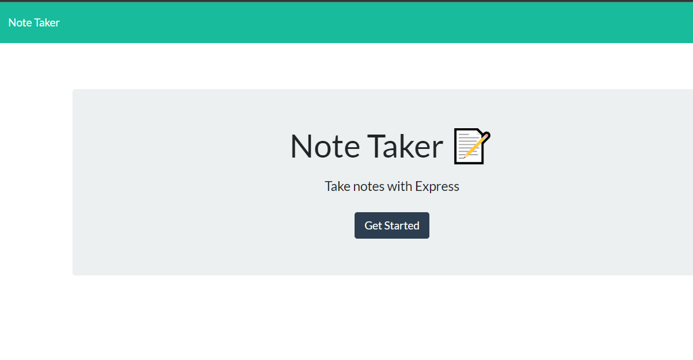
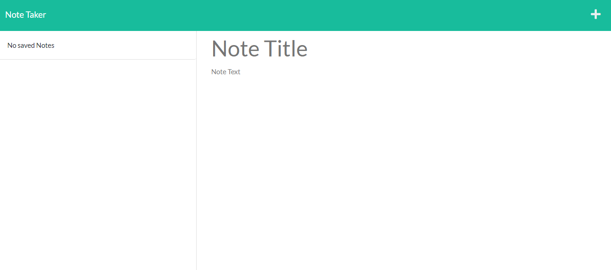

# Express.js: Note Taker

## Description 

This is a note taker application that can be used to write, save, and delete notes. It uses an Express.js back end, and saves and retrieves note data from the JSON file.

In this assignment, the author is tasked to modify starter code to create the application. The application's front end has already been created, while the author is tasked to build the back end, connect the two, and then deploy the entire application to Heroku.

### Appearance 
The applications when you load the page and when you click the start button. Landing page(index.html):

After you clicked start(notes.html)

## Deployed site
> To see how the application works, please check out the deployed side on [Heroku](https://note-taker-ae.herokuapp.com/).
> To see my commits and raw code visit my [GitHub](https://github.com/alyesp/note-taker)

## Features 
  After you have clicked on the "Get Started" button on the home page. You will be prompted to add a title for your note and then the description of the note. After oyu have completed this note you will then click on the save button that is located on the upper right of the screen. To add a new note you will click on the plus(+) sign, that is also located on the top right of the screen and then you can create a new note/task. If, for any reason you have completed you task and/or no longer want that note/task to be stored, you can click the trash can icon and it will discard your note/task. 

## Back End Requirements
1. The application includes a db.json file used to store and retrieve notes using the fs module.

2. The following HTML routes are created:

* GET /notes that returns the notes.html file.

* GET * that returns the index.html file.

3. The following API routes are created:
* GET /api/notes that reads the db.json file and returns all saved notes as JSON.

* POST /api/notes that receives a new note to save on the request body, add it to the db.json file, and then returns the new note to the client.

4. A DELETE route is added to the application using the following guideline:
* The DELETE /api/notes/:id receives a query parameter that contains the id of a note to delete. To delete a note, the user needs to read all notes from the db.json file, remove the note with the given id property, and then rewrite the notes to the db.json file.

